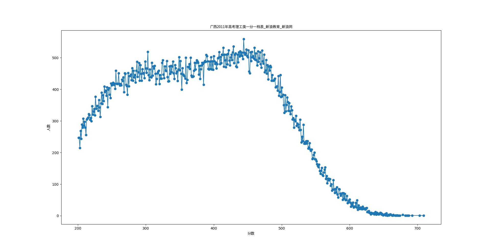
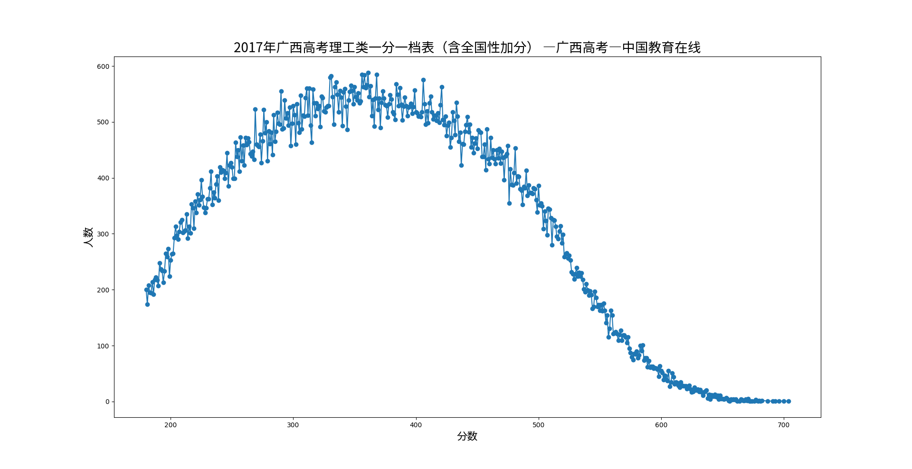

# grade_distribution
高考分数分布

# 打开方式
```bash
git clone https://github.com/cryptogun/grade_distribution
cd grade_distribution
pip install -r requirements.txt
python3 ./draw.py
```
编辑`draw.py`修改**一分一档表**来源网址和正确的标题.
# 图例
2011广西理科  

2017广西理科  

